## **EE6470_ESL_HW1**
### <span style="font-family: '標楷體'; font-weight: lighter;">112062707 廖哲緯</span> 
## **Part 1**
### Introduction
Use Gaussian Blur Filter (show below) to lab2 replace Sobel filter.
[Gaussian Smoothing](https://homepages.inf.ed.ac.uk/rbf/HIPR2/gsmooth.htm)

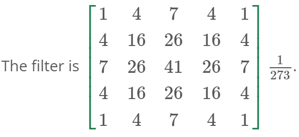

And choose the [images](https://www.imageprocessingplace.com/downloads_V3/root_downloads/image_databases/standard_test_images.zip) from the standard image test files.

In the hw I use the python code to convert the original images to grayscale bmp format
```Python
import cv2
import numpy as np

# https://github.com/SamratSahoo/UT-Arlington-Research/blob/master/Week%206%20-%20Convolutions%20%26%20Wavelet%20Transforms/Convolutions.py
def convolve2D(image, kernel, padding=0, strides=1):
    # Cross Correlation
    kernel = np.flipud(np.fliplr(kernel))

    # Gather Shapes of Kernel + Image + Padding
    xKernShape = kernel.shape[0]
    yKernShape = kernel.shape[1]
    xImgShape = image.shape[0]
    yImgShape = image.shape[1]

    # Shape of Output Convolution
    xOutput = int(((xImgShape - xKernShape + 2 * padding) / strides) + 1)
    yOutput = int(((yImgShape - yKernShape + 2 * padding) / strides) + 1)
    output = np.zeros((xOutput, yOutput))

    # Apply Equal Padding to All Sides
    if padding != 0:
        imagePadded = np.zeros((image.shape[0] + padding*2, image.shape[1] + padding*2))
        imagePadded[int(padding):int(-1 * padding), int(padding):int(-1 * padding)] = image
        # print(imagePadded)
    else:
        imagePadded = image

    # Iterate through image
    for y in range(image.shape[1]):
        # Exit Convolution
        if y > image.shape[1] - yKernShape:
            break
        # Only Convolve if y has gone down by the specified Strides
        if y % strides == 0:
            for x in range(image.shape[0]):
                # Go to next row once kernel is out of bounds
                if x > image.shape[0] - xKernShape:
                    break
                try:
                    # Only Convolve if x has moved by the specified Strides
              if x % strides == 0:
                  output[x, y] = (kernel * imagePadded[x: x + xKernShape, y: y + yKernShape]).sum()
          except:
              break

    return output

def add_noise(img, n):
    img2 = img
    for _ in range(n):
        x = int(np.random.random() * img.shape[0])
        y = int(np.random.random() * img.shape[1])
        img2[x, y] = 255 # white in gray scale is 255
    return img2

if __name__ == '__main__':
    # Input original image file
    # To use another image input file, please change the filename
    # Also the downloaded 'standard_test_images/' should be in the same folder
    filename='lena_color_256'
    img = cv2.imread(f'./standard_test_images/{filename}.tif')
    # Write out original image in bmp format
    cv2.imwrite(f'./{filename}.bmp', img)

    # Add white noise points and write out another bmp file
    noise_img = add_noise(img, 100)
    cv2.imwrite(f'./{filename}_noise.bmp', noise_img)

    # Convert to grayscale image
    image = cv2.cvtColor(src=img, code=cv2.COLOR_BGR2GRAY)

    # Gaussian blur Kernel 5x5
    kernel = np.array([[1, 4, 7, 4, 1], [4, 16, 26, 16, 4], [7, 26, 41, 26, 7], [4, 16, 26, 16, 4], [1, 4, 7, 4, 1]])
    kernel_scale= kernel/273
    # Convolve and Save Output
    output = convolve2D(image, kernel_scale, padding=2)
    cv2.imwrite(f'{filename}_noise_gaussian.bmp', output)
```
### **Part1 requirment**

(40 pt) Gaussian blur filter with FIFO channels
* Please implement the filter with one SystemC module.
* Please use SystemC FIFO channels to connect the testbench with the module.
* You may reuse the same code base from Sobel Filter with FiFO channels in lab 2.
---
## **Part 2**
### Introduction
Based on the previous question, add an input buffer to increase data utilization.

And in this Hw part2, I use a 25x1 row buffer to  save the grey pixel number.
### **Part2 requirment**
(60 pt) Data buffers
* Please rewrite the above image filter module with an additional input buffer.
* We only buffer the input pixels. The filter parameters are embedded inside the module.
* The buffer size is fixed and at most 25 pixels.
* You may choose to orgranize the buffer as row buffer (1x5, 1x16, 1x25), column buffer (5x1, 16x1, 25x1), or 2D buffer (4x4, 5x5).
* Please use the buffer to reduce the data transfer between testbench and filter module.
* Please compare the number of pixel transfer of between the original implementation and the one with buffers.
---
### How to run
```powershell
$ cd part1/sobel_fifo/build
or
$ cd part2/sobel_fifo/build
```
Delet these files "CMakeFiles", "cmake_install.cmake", "CMakeCache.txt", "Makefile", "sobel". which in the build
```powershell
$ cmake ..
```
```powershell
$ make run
```
### Result
### Part 1
* input image


* output image


* goden image

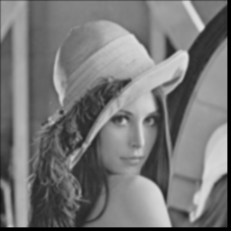

* input image

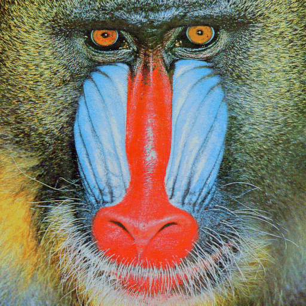

* output image

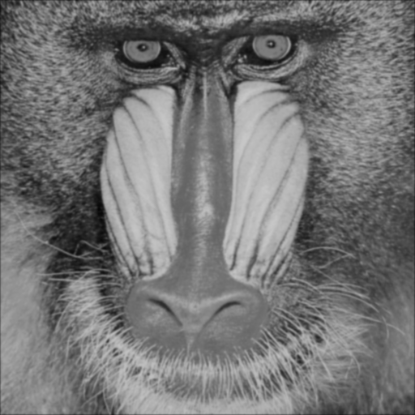

* goden image


### Run time
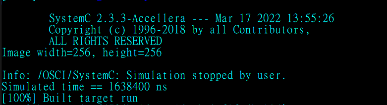

---
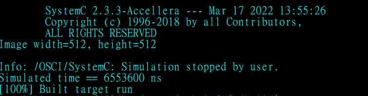
### Part 2
* input image

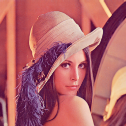

* output image

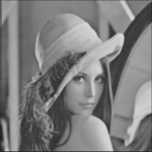

* goden image


* input image


* output image


* goden image

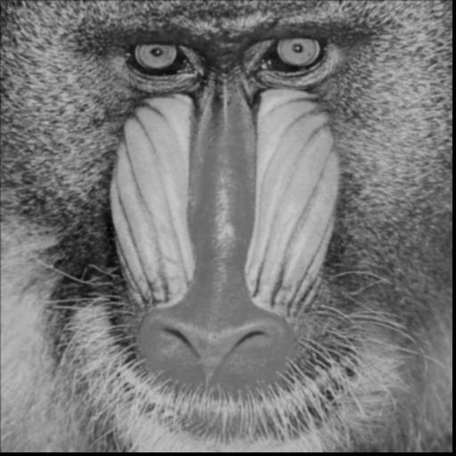

### Run time
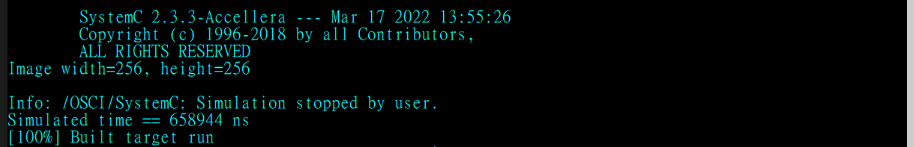

---
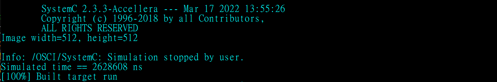
